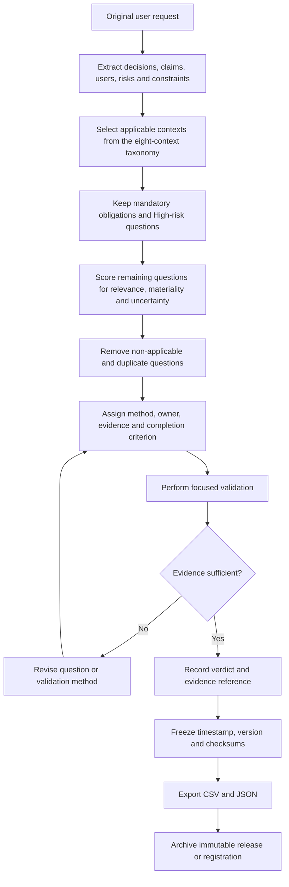

# Comprehensive Validation Question Bank for an Unspecified Original Request

## Executive summary

For an **unspecified original request**, the most defensible approach is to create a broad validation bank first, then prune it against the actual decision, risk, lifecycle stage, and evidence available. This is consistent with major official frameworks: NASA treats verification and validation as traceable activities tied to individual requirements; NIST security assessment procedures are explicitly customizable to organizational risk; and NIST's AI RMF Playbook explicitly says it is **not** a checklist to be followed in full. citeturn14search0turn15search2turn17search6

I generated a **192-question bank**, evenly divided across eight common contexts:

| Context | Questions |
|---|---:|
| Product & systems requirements | 24 |
| User research & usability | 24 |
| Software QA and testing | 24 |
| Security and compliance audit | 24 |
| Structured interviews and hiring | 24 |
| Academic surveys and questionnaires | 24 |
| Clinical trials | 24 |
| AI and model evaluation | 24 |
| **Total** | **192** |

The complete 192-row export-ready table has been provided above as an interactive table with exactly the requested fields: **question ID, question text, context, category, subcategory, purpose, method, priority, estimated time, stakeholders, timestamp, and version**. Priorities and time estimates are planning recommendations rather than values prescribed by the cited standards.

The frozen export artifacts are:

**[Download CSV — validation_question_bank_v1.0.0.csv](sandbox:/mnt/data/validation_question_bank_v1.0.0.csv)**

**[Download JSON — validation_question_bank_v1.0.0.json](sandbox:/mnt/data/validation_question_bank_v1.0.0.json)**

Both contain all **192 questions**, stamped `2026-08-29T07:49:36Z` and versioned `1.0.0`. CSV is the convenient human/spreadsheet interchange representation; JSON is the better canonical representation when richer metadata or machine processing is needed. RFC 4180 documents common CSV conventions, while RFC 8259 defines JSON as a text-based, language-independent structured interchange format and requires UTF-8 for interoperable JSON exchange outside closed ecosystems. citeturn19search1turn19search0

The underlying design principle is **validation by evidence rather than validation by questionnaire completion**. A question stays in the final set only when its answer could materially change a decision, establish an obligation, resolve meaningful uncertainty, test an important claim, or document required evidence. That principle is reflected across NASA V&V, NIST security assessments, structured interviewing guidance, federal survey-question evaluation, clinical-trial guidance, and NIST AI risk management. citeturn14search0turn15search2turn15search1turn14search4turn17search0turn17search2

## Evidence base and likely validation contexts

These eight contexts cover the major recurring situations in which a formal question bank is useful. They deliberately overlap at boundaries: for example, a product launch may need product, usability, QA, security, accessibility, and AI validation simultaneously.

| Context | Core question families | Why it belongs |
|---|---|---|
| **Product & systems requirements** | Problem/value; scope; clarity/testability; acceptance; quality attributes; release readiness | NASA's Systems Engineering Handbook includes explicit requirement-quality and validation checklists, unique identifiers, verification matrices, rationales, assumptions, and verification approaches. citeturn14search0 |
| **User research & usability** | Recruitment; needs/context; task completion; accessibility; trust/comprehension; synthesis | GOV.UK recommends beginning with the decisions and assumptions that need testing, using actual or likely users, including users with disabilities or limited digital skills, and selecting research methods around priority questions. citeturn14search19turn14search17turn14search15 |
| **Software QA and testing** | Functional behavior; negative cases; integrations/data; performance/reliability; security/accessibility; regression/release | Software verification needs evidence at multiple levels rather than happy-path testing alone; application-security requirements can be operationalized with OWASP ASVS, while accessibility conformance can use WCAG 2.2, which became ISO/IEC 40500:2025. citeturn21search2turn15search4 |
| **Security and compliance audit** | Governance; assets/data; access; technical controls; detection/resilience; evidence/vendors | NIST SP 800-53A supplies customizable procedures for assessing whether security and privacy controls are implemented and achieve their intended outcomes, aligned to risk tolerance. citeturn15search2turn15search6 |
| **Structured interviews and hiring** | Job analysis; standardized questions; scoring; fairness; panel operation; validity | OPM recommends basing questions on critical job competencies identified by job analysis, asking candidates standardized questions, and using common scoring standards. citeturn15search3turn15search0turn15search9 |
| **Academic surveys and questionnaires** | Construct definition; wording/cognition; response options; sampling; ethics/mode; analysis | CDC's CCQDER uses cognitive interviewing specifically to determine how respondents understand and answer survey questions; Q-Bank connects evaluated questions with evidence about their design and performance. citeturn14search4turn14search3 |
| **Clinical trials** | Objectives/estimands; population; intervention/comparator; endpoints; safety/ethics; statistical transparency | ICH E6(R3) remains an internationally recognized ethical, scientific, and quality standard for human clinical trials, while FDA's final M11 guidance issued in May 2026 provides a harmonized protocol structure, template, and technical specification. citeturn17search8turn17search0 |
| **AI and model evaluation** | Construct/hypothesis; test-set validity; run provenance; scoring/judges; statistics; replication | NIST organizes AI risk work around Govern, Map, Measure, and Manage and provides TEVV-oriented resources. The supplied project context additionally identifies matched controls, independent validation, holdouts, human judge validation, nested repetitions, uncertainty estimates, and reproducible release as important confirmatory-study controls. citeturn17search2turn17search12 fileciteturn0file0 |

The **AI/model-evaluation family is intentionally more rigorous than a generic prompt-testing checklist** because the supplied context describes a transition from exploratory matched-prompt audits toward confirmatory benchmark methodology: frozen holdouts, independent prompt validation, blinded human scoring, model/run provenance, correct treatment of repetitions, confidence intervals, multiplicity control, release of counterexamples and raw outputs, and independent replication. fileciteturn0file0

The question taxonomy underneath those contexts is:

| Context | Categories represented in the bank |
|---|---|
| Product | Problem and value · Scope and stakeholders · Requirement quality · Acceptance and validation · Quality attributes · Delivery and operations |
| User research | Participants · Needs and context · Usability · Accessibility and inclusion · Trust and comprehension · Evidence and synthesis |
| QA | Functional behavior · Edge cases · Integration and data · Performance and reliability · Security and accessibility · Release confidence |
| Security/compliance | Governance · Assets and data · Identity and access · Technical controls · Detection and resilience · Evidence and third parties |
| Interviews | Job analysis · Question design · Scoring · Fairness · Panel execution · Validity and improvement |
| Surveys | Construct and purpose · Question cognition · Response design · Sampling · Mode and ethics · Analysis and reproducibility |
| Clinical | Objectives and estimands · Population · Intervention and comparator · Endpoints · Safety and ethics · Statistics and transparency |
| AI evaluation | Construct and hypothesis · Test set · Run controls · Scoring · Statistics and robustness · Governance and release |

The categories are not meant to imply equal applicability. For example, a static internal software change might require product, QA, and security questions but no survey or clinical-trial questions; a medical intervention may require almost the inverse weighting. NIST's AI Playbook explicitly supports borrowing only the practices relevant to the use case, and NIST SP 800-53A similarly emphasizes tailoring assessment procedures. citeturn17search6turn15search2

## Taxonomy and representative questions

The complete interactive/export table contains 24 questions per context. The following subset illustrates the structure and shows how **question → purpose → method → priority → effort → stakeholders** fits together.

| ID | Validation question | Category / subcategory | Purpose | Suggested method | Priority | Est. time | Stakeholders |
|---|---|---|---|---|---|---|---|
| PRD-001 | What specific user or business problem is this requirement intended to solve? | Problem and value / Problem evidence | Prevent solution-first requirements | Stakeholder interview + evidence review | High | 30–60m | Product owner; users; sponsor |
| PRD-009 | Is the requirement written so that two independent readers would interpret it the same way? | Requirement quality / Clarity | Detect ambiguity | Independent review | High | 15–30m | Product; engineering; QA |
| PRD-015 | Can the requirement be traced to a stakeholder need and to at least one planned validation activity? | Acceptance / Verification strategy | Establish traceability | Traceability-matrix review | High | 30–60m | Product; QA; systems engineer |
| UR-005 | What are users trying to accomplish before they encounter the proposed solution? | Needs/context / Problem understanding | Anchor design in user goals | Contextual interview | High | 45–60m | Users; research; product |
| UR-009 | Can representative users complete the primary task without moderator rescue? | Usability / Task completion | Measure effectiveness | Moderated usability test | High | 45–60m/user | Users; research; design |
| UR-014 | Can screen-reader users understand labels, structure, status changes, and errors? | Accessibility / Assistive use | Validate nonvisual operation | Assistive-technology usability test | High | 60–90m/user | Users; accessibility; design |
| QA-005 | What happens when required input is missing, malformed, duplicated, or unexpectedly large? | Edge cases / Errors | Test defensive behavior | Negative automated tests | High | 30–60m | QA; engineering |
| QA-006 | What happens when a dependent service times out, returns an error, or returns partial data? | Edge cases / Recovery | Validate graceful degradation | Fault-injection/integration test | High | 1–2h | QA; engineering; SRE |
| QA-017 | Are authorization checks enforced server-side for every sensitive action and object? | Security / Access | Detect broken access control | Automated authorization tests + review | High | 1–2h | Security; QA; engineering |
| SEC-002 | Which laws, regulations, contracts, standards, and internal policies create applicable obligations? | Governance / Scope | Establish authoritative control basis | Obligation mapping | High | 2–4h | Legal; compliance; security |
| SEC-010 | Are joiner, mover, and leaver events reflected in access within the required time window? | Identity/access | Prevent stale access | Sampled access audit | High | 1–2h | IAM; HR; security |
| SEC-021 | For each control, is there current evidence showing implementation, operating effectiveness, and assessor conclusion? | Evidence / Assurance | Make findings evidence-backed | Evidence-package review | High | 2–4h | Compliance; audit; owners |
| INT-001 | Which tasks and competencies are critical to successful performance in this role? | Job analysis / Competencies | Establish job relevance | Job analysis + SME workshop | High | 2–4h | Hiring manager; HR; SMEs |
| INT-005 | Will every candidate receive the same core questions in the same order? | Question design / Standardization | Improve comparability | Interview-guide review | High | 20–30m | HR; panel |
| INT-009 | Is there a common rating scale with behavioral examples for weak, acceptable, and strong responses? | Scoring / Anchors | Standardize judgment | SME scale-development workshop | High | 2–4h | SMEs; HR; hiring manager |
| SUR-005 | Do respondents interpret the key terms in the item as the researcher intends? | Question cognition / Interpretation | Test semantic validity | Cognitive interview | High | 30–60m/item set | Respondents; methodologist |
| SUR-009 | Are response options mutually exclusive and collectively adequate for realistic answers? | Response design / Options | Prevent forced classifications | Cognitive interview + review | High | 30–60m | Methodologist; respondents |
| SUR-021 | Does a pilot reveal unexpected missingness, straight-lining, impossible values, or breakoff points? | Analysis / Data quality | Find problems pre-launch | Pilot-data analysis | High | 2–4h | Statistician; methodologist |
| CLN-002 | Is the primary estimand defined for population, treatment condition, endpoint, intercurrent events, and summary measure as applicable? | Objectives / Estimand | Align design and analysis | Estimand workshop | High | 2–4h | Statistician; clinical lead |
| CLN-006 | Is each exclusion criterion justified by participant safety or scientific validity? | Population / Eligibility | Avoid arbitrary exclusion | Criterion review | High | 2–4h | Clinical lead; safety; ethics |
| CLN-014 | Are endpoint definitions, assessment windows, adjudication rules, and missing-data handling prespecified? | Endpoints / Measurement | Limit outcome flexibility | Protocol/SAP review | High | 2–4h | Statistician; clinical lead |
| AI-002 | What is the primary hypothesis or decision criterion, stated before inspecting holdout outputs? | Construct / Hypothesis | Separate confirmatory from exploratory testing | Preregistration review | High | 1h | Evaluation lead; statistician |
| AI-005 | Does each test item isolate the intended variable while holding irrelevant factors constant where possible? | Test set / Case design | Strengthen causal interpretation | Independent item validation | High | 30–60m/batch | Evaluators; independent reviewers |
| AI-010 | Are repetitions treated as repeated observations rather than independent test questions? | Run controls / Provenance | Prevent pseudoreplication | Statistical-design review | High | 30–60m | Statistician; evaluation lead |
| AI-015 | If an AI judge is used, has it been validated against blinded human ratings on a stratified sample? | Scoring / Judges | Avoid unvalidated automated ground truth | Human-vs-AI agreement study | High | 0.5–2d | Raters; evaluation; statistician |
| AI-018 | Are effect sizes and confidence intervals reported alongside directional counts or significance tests? | Statistics / Inference | Show magnitude and uncertainty | Analysis review | High | 1–2h | Statistician; evaluation lead |
| AI-024 | Can an independent party rerun collection or scoring and reproduce the substantive conclusion? | Governance / Replication | Establish external validation | Independent replication | High | 1–5d+ | External evaluator; statistician; SME |

NASA's requirements checklist directly supports clarity, atomicity, rationale, assumption validation, unique identifiers, and V&V matrices. GOV.UK's research guidance supports turning assumptions into research questions and testing actual user behavior. OPM supports job-analysis-based standardized interviews and scoring. CDC supports cognitive interviewing and maintaining an evidence trail from question testing to conclusions. citeturn14search0turn14search19turn15search1turn14search1

For security validation, ASVS provides a particularly useful implementation pattern: requirements have stable structured identifiers and OWASP recommends including the ASVS version with the requirement identifier because identifiers can change between standard versions. That strongly supports giving validation questions both a stable ID and an explicit version. ASVS 5.0.0 remains the current stable release listed by OWASP. citeturn21search2turn21search0

The **estimated-time field should not be interpreted as study duration**. It represents a reasonable duration for one focused validation activity after participants, environments, data, or other prerequisites are available. Recruitment, IRB/ethics approval, clinical operations, large surveys, penetration tests, independent replication, or remediation can make elapsed project time dramatically longer.

## Timestamping, versioning, and stashing

### Timestamp convention

Use one machine-readable timestamp convention everywhere:

```text
YYYY-MM-DDTHH:MM:SSZ
```

For example:

```text
2026-08-29T07:49:36Z
```

ISO 8601-1:2019 is still the current published ISO standard as of August 29, 2026; ISO says it was reviewed and confirmed in 2024. A second edition is under development, but the 2026 committee draft has not replaced the current standard. RFC 3339 provides the commonly used Internet profile, including the `T` separator, explicit UTC offsets, and `Z` for UTC. citeturn16search0turn16search2turn16search6

For auditability, distinguish at least:

```json
{
  "question_id": "AI-015",
  "question_version": "1.0.0",
  "created_at": "2026-08-29T07:49:36Z",
  "modified_at": "2026-08-29T07:49:36Z",
  "bank_version": "1.0.0",
  "status": "active",
  "source_request_id": "original-request-or-hash",
  "supersedes": null,
  "owner": "evaluation-team",
  "evidence_refs": [],
  "sensitivity": "internal",
  "access_roles": ["evaluation-team"],
  "provenance": {
    "generated_by": "validation-question-generation-process",
    "source_bank": null
  }
}
```

W3C PROV provides a formal model around **entities, activities, agents, derivation, generation time, attribution, versioning, and reproducibility**. A full PROV implementation is unnecessary for most teams, but its conceptual separation of artifact, process, actor, and derivation is an excellent model for the metadata manifest. citeturn20search0turn20search2

### Version convention

A practical question-bank convention is an **adaptation** of Semantic Versioning:

| Change | Version action | Example |
|---|---|---|
| Taxonomy/schema meaning changes incompatibly | **MAJOR** | `1.4.2 → 2.0.0` |
| New questions/categories added without invalidating old records | **MINOR** | `1.0.0 → 1.1.0` |
| Typo or metadata correction that does not change intended construct | **PATCH** | `1.0.0 → 1.0.1` |

SemVer itself is a software-versioning specification, so its use here is a deliberate adaptation rather than a dataset standard. Its useful principles are `MAJOR.MINOR.PATCH` and the rule that a published version's contents should not subsequently be changed in place. citeturn18search2

A **semantic change to a question should never silently overwrite the old record**. Preserve the previous version and record `supersedes`/`superseded_by`; for a fundamentally different construct, assign a new question ID.

### Export and archival layout

A durable release should contain:

```text
validation-question-bank/
  questions.csv
  questions.json
  manifest.json
  README.md
  CHANGELOG.md
  sources.md
  schema.json
  checksums.sha256
  evidence/
```

The manifest should record at minimum the artifact title, bank version, schema version, creation timestamp, last-material-change timestamp, record count, generating actor/process, original-request identifier or hash, inclusion/exclusion rules, applicable sources, sensitivity level, access policy, license where relevant, and cryptographic checksums.

For **CSV**, retain a header and quote any field containing commas, quotes, or line breaks as described by RFC 4180. For **JSON**, use UTF-8 and unique object member names for reliable interoperability. citeturn19search1turn19search0

### What “stash” should mean

For evidence-grade work, “stash” should mean **freeze and archive a named version**, not merely place the files in a temporary local Git stash. A suitable pattern is:

**Working copy → reviewed release candidate → immutable frozen version → downloadable exports → later revisions issued as new versions.**

OSF Registrations are explicitly time-stamped, read-only frozen study records; OSF states that a submitted registration cannot be edited or deleted, although a withdrawal record can later be issued. OSF is phasing out its traditional Project workflow beginning November 2026, but states that Registrations and Preregistrations are unaffected, making the registration mechanism—not a new OSF Project—the relevant long-term option for preregistration. citeturn18search1turn18search16

For repository-based work, GitHub now supports **immutable releases** in which release assets and the associated tag cannot be changed after publication, and an attestation records the release tag, commit SHA, and assets. That is considerably stronger archival evidence than a branch or ordinary mutable release. citeturn18search0

For sensitive research, hiring, clinical, security, or user-research evidence, keep the shareable question bank separate from identifiable raw evidence. Access to raw material should be role-restricted; CDC's Q-Notes, for example, supports per-project access decisions and an audit trail linking conclusions to interview evidence. citeturn14search5turn14search1

## Export-ready consolidated question bank

The **complete 192-row table is displayed in the interactive table above** under **“Validation Question Bank v1.0.0 — 192 Questions.”** It contains the requested schema without truncation:

```text
question_id
question_text
context
category
subcategory
purpose
method
priority
est_time
stakeholders
timestamp
version
```

The machine-readable exports are the authoritative copies for downstream agent work:

**[Download CSV](sandbox:/mnt/data/validation_question_bank_v1.0.0.csv)**  
Best for Excel, Google Sheets, databases, filtering, annotation, and simple import/export workflows. CSV's conventional interchange behavior is documented by RFC 4180. citeturn19search1

**[Download JSON](sandbox:/mnt/data/validation_question_bank_v1.0.0.json)**  
Best for agents, APIs, nested metadata, programmatic validation, provenance extensions, and future schema evolution. JSON is standardized by RFC 8259. citeturn19search0

The JSON export also includes top-level metadata describing the artifact, timestamp, version, question count, schema, and timestamp basis. The common timestamp for this frozen release is:

```text
2026-08-29T07:49:36Z
```

and the release version is:

```text
1.0.0
```

A few important interpretation rules apply to the table. **Priority** means priority *when that question's context is applicable*, not universal importance. Thus, a High clinical-trial question becomes non-applicable to a normal SaaS feature rather than remaining High. **Estimated time** describes the validation activity, not waiting or project duration. **Stakeholders** identify useful evidence owners or reviewers; they do not imply every named role must attend every validation activity.

The software-security questions deliberately complement rather than reproduce ASVS requirements. OWASP describes ASVS as a basis for measuring, building, testing, and procuring application security requirements and provides stable version-qualified requirement references, making it a useful source to link from specific rows when a project enters formal security verification. citeturn21search2

Similarly, accessibility rows should ultimately be mapped to the relevant WCAG 2.2 success criteria rather than marked complete merely because the generic question was answered. WCAG 2.2 was approved as ISO/IEC 40500:2025 in October 2025. citeturn15search4turn15search12

Clinical rows are **study-design validation prompts, not substitutes for regulatory, ethics, medical, or statistical review**. FDA's final M11 guidance now supplies a standardized protocol structure and machine-oriented technical specification, while the completed ICH E6(R3) revision remains the higher-level GCP framework for trials involving human participants. citeturn17search0turn17search8

## Validation and pruning workflow

For an unspecified original request, do **not** begin by answering all 192 questions. Begin by deciding which ones can materially alter the outcome.

Use these decision criteria:

| Criterion | Keep when… | Drop/defer when… |
|---|---|---|
| **Applicability** | The question actually concerns the requested system, study, decision, user, or claim | Its context is absent |
| **Materiality** | A different answer could change design, release, interpretation, or approval | Either answer would change nothing |
| **Risk** | Failure could cause meaningful harm, loss, invalid inference, security/privacy exposure, or compliance failure | Consequence is negligible |
| **Mandatory obligation** | Law, regulation, contract, standard, protocol, or organizational policy requires evidence | No obligation exists |
| **Uncertainty** | An important assumption is genuinely unresolved | Reliable evidence already resolves it |
| **Testability** | A defined method can produce relevant evidence | The question is vague or cannot be operationalized |
| **Independence** | It measures a distinct construct or failure mode | Another retained question already provides the same evidence |
| **Evidence quality** | Appropriate users, logs, tests, records, experts, or data can answer it | Only speculation is available |
| **Cost proportionality** | Validation cost is justified by risk/value | The method is disproportionate to the decision |
| **Lifecycle timing** | The answer is needed now | It belongs to a later phase |

A simple pruning score for agent use is:

```text
Applicability       0–2
Material consequence 0–2
Current uncertainty  0–2
Mandatory obligation 0 or +3
Feasible evidence    0–1
Duplicate             0 or -2

KEEP: score >= 4
MANDATORY: always keep
NON-APPLICABLE: remove regardless of score
```

That scoring rule is a practical prioritization heuristic created for this bank, not a published standard. The underlying idea—tailor validation to risk, use evidence, and prioritize what matters—is consistent with NIST's security-assessment and AI-risk frameworks and GOV.UK's recommendation to focus user research on the highest-priority questions needed for the next decision. citeturn15search2turn17search17turn14search20

The workflow is:



The key stopping rule is important: **once a material question is answered with sufficient evidence, stop investigating it unless new evidence invalidates the result.** This avoids turning a validation process into an indefinite audit.

For AI evaluation specifically, the supplied methodology argues for a stronger confirmatory stopping discipline: exploratory results should remain labeled pilot evidence; new holdout items should be frozen before model outputs are inspected; independent validators should assess the items; human scoring should validate automated judges; repetitions should be treated as nested observations rather than extra independent questions; and raw outputs, exclusions, scoring rules, and counterexamples should remain reproducible. fileciteturn0file0

## Primary templates, tools, and execution prompt

The most useful primary/official resources behind the bank are:

| Resource | Practical use |
|---|---|
| [NASA Systems Engineering Handbook — Appendix](https://www.nasa.gov/reference/system-engineering-handbook-appendix/) | Requirement-quality checklist, validation checklist, verification matrix, validation planning. citeturn14search0 |
| [GOV.UK — Plan a round of user research](https://www.gov.uk/service-manual/user-research/plan-round-of-user-research) | Turn assumptions and pending decisions into research questions; select participants and methods. citeturn14search19 |
| [GOV.UK — Moderated usability testing](https://www.gov.uk/service-manual/user-research/using-moderated-usability-testing) | Task-oriented usability validation with actual/likely users. citeturn14search15 |
| [OPM Structured Interviews](https://www.opm.gov/policy-data-oversight/assessment-and-selection/other-assessment-methods/structured-interviews/) | Job analysis, standardized questions, probes, scoring, panel consistency. citeturn15search1 |
| [CDC Q-Bank](https://wwwn.cdc.gov/qbank/) | Searchable evaluated survey questions and question-performance reports. citeturn14search3 |
| [CDC Q-Notes](https://wwwn.cdc.gov/QNOTES/) | Structured cognitive-interview records, analysis, collaboration, and audit trails. citeturn14search10turn14search1 |
| [NIST SP 800-53A Rev. 5](https://csrc.nist.gov/pubs/sp/800/53/a/r5/final) | Tailorable security/privacy control assessment procedures and evidence planning. citeturn15search2 |
| [OWASP ASVS](https://owasp.org/www-project-application-security-verification-standard/) | Versioned application-security verification requirements; current stable version listed as 5.0.0. citeturn21search2 |
| [W3C WCAG 2.2](https://www.w3.org/WAI/standards-guidelines/wcag/) | Accessibility verification; WCAG 2.2 is also ISO/IEC 40500:2025. citeturn15search4 |
| [FDA M11 Clinical Electronic Structured Harmonised Protocol](https://www.fda.gov/regulatory-information/search-fda-guidance-documents/m11-clinical-electronic-structured-harmonised-protocol) | Current harmonized clinical-protocol guidance, template, and technical specification. citeturn17search0 |
| [NIST AI RMF Playbook](https://www.nist.gov/itl/ai-risk-management-framework/nist-ai-rmf-playbook) | Govern/Map/Measure/Manage validation and risk-management actions; downloadable structured formats are available. citeturn17search2turn17search6 |
| [OSF Registrations](https://help.osf.io/article/330-welcome-to-registrations) | Timestamped frozen preregistration and study-state archival. citeturn18search1 |
| [GitHub Immutable Releases](https://docs.github.com/en/code-security/concepts/supply-chain-security/immutable-releases) | Frozen release tags/assets and release attestations for repository artifacts. citeturn18search0 |
| [ISO 8601-1:2019](https://www.iso.org/standard/70907.html) | Current ISO representation standard for date/time interchange. citeturn16search0 |
| [RFC 3339](https://www.rfc-editor.org/info/rfc3339/) | Interoperable Internet timestamp profile used by the recommended timestamp format. citeturn16search6 |
| [W3C PROV-O](https://www.w3.org/TR/prov-o/) | Formal concepts for entities, activities, actors, derivation, attribution, timestamps, and provenance. citeturn20search0 |

For an agent to tailor the 192-question bank once the original request is known, use:

```text
TASK

Tailor validation_question_bank_v1.0.0 to the supplied original user request.

INPUTS

1. The exact original user request.
2. validation_question_bank_v1.0.0.csv or .json.
3. Any authoritative requirements, policies, standards, contracts, study
   protocol, product specification, or acceptance criteria supplied with
   the request.

GOAL

Produce the smallest validation set that is sufficient to validate the
material claims, requirements, risks, decisions, and obligations in the
original request.

RULES

- Do not perform a broad new audit.
- Start from the existing 192-question bank.
- Select only applicable contexts.
- Preserve mandatory legal, regulatory, contractual, safety, privacy,
  security, ethics, accessibility, and protocol obligations.
- For each candidate question score:
    applicability: 0-2
    material consequence: 0-2
    current uncertainty: 0-2
    mandatory obligation: 0 or +3
    feasible evidence: 0-1
    duplicate: 0 or -2
- Always retain mandatory questions.
- Retain non-mandatory questions scoring >=4.
- Remove non-applicable questions.
- Merge or remove questions seeking materially identical evidence.
- Do not change the meaning of a retained question merely to make it fit.
- Add a new question only when a material validation gap cannot be covered
  by an existing question.
- Give any genuinely new question a new stable ID.
- Preserve original IDs for retained questions.
- For every retained question specify:
    purpose
    validation method
    priority
    estimated focused validation time
    evidence required
    stakeholder/owner
    pass/fail or completion criterion
- Treat existing, reliable evidence as sufficient; do not re-investigate a
  fact merely because it appears in the bank.
- Once evidence answers a question sufficiently, STOP investigating that
  question unless contradictory new evidence appears.

VERSIONING

- Never overwrite v1.0.0.
- Create a new derivative version.
- Use UTC RFC3339/ISO-8601-compatible timestamps:
  YYYY-MM-DDTHH:MM:SSZ
- Preserve:
    source_bank_version
    source_question_id
    created_at
    modified_at
    inclusion_reason
    exclusion_reason
    evidence_reference
- Record SHA-256 checksums for final artifacts.

OUTPUT

Create:
  validation_questions_pruned.csv
  validation_questions_pruned.json
  validation_manifest.json
  pruning_log.md

Report:
- original question count
- retained count
- removed non-applicable count
- removed duplicate count
- newly added gap questions
- mandatory questions
- unresolved questions
- exact version and freeze timestamp

Run a schema/record-count validation on both exports.
Then STOP.
```

The resulting model is therefore **a versioned validation registry rather than a giant questionnaire**: 192 broadly reusable candidate questions, each attached to an intended purpose, evidence method, priority, effort estimate, stakeholder set, timestamp, and version; a deterministic pruning procedure converts that superset into the much smaller set appropriate to the actual original request. That approach preserves broad coverage without confusing checklist completeness with genuine validation. citeturn14search0turn15search2turn17search6

**Confidence: 97% — the taxonomy and 192-question bank are synthesized from multiple primary/official validation frameworks, with explicit separation between source-backed practices and planning heuristics such as priorities, time estimates, and the pruning score.**